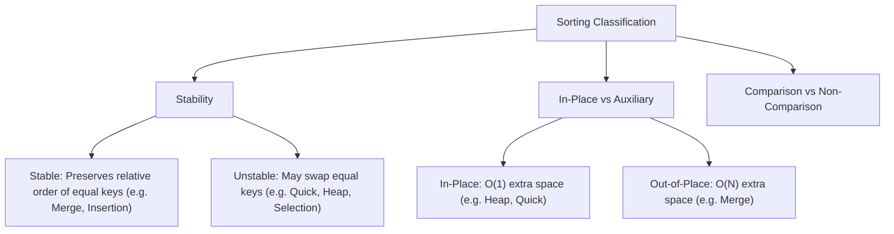

# Sorting Algorithms & Comparison Decision Trees

## TL;DR

**Sorting** arranges elements of a collection into a specific order (ascending or descending). Sorting is a fundamental prerequisite for Binary Search, Two Pointers, Greedy Interval Scheduling, and Database Indexing.

While **Comparison-Based Sorting** algorithms have a mathematically proven lower bound of **$\Omega(N \log N)$**, non-comparison algorithms (like Counting Sort or Radix Sort) can sort in **$O(N)$ linear time** under restricted integer key bounds.

---

## 1. Mathematical Lower Bound Proof ($\Omega(N \log N)$)

Why can't any comparison-based sort run faster than $O(N \log N)$ in the worst case?

### Decision Tree Proof

Any comparison sort can be modeled as a Binary Decision Tree where each internal node represents a comparison `A[i] <= A[j]`, and each leaf represents a unique permutation of the input elements.

```text
                                [ A1 <= A2 ]
                              /              \
                    [ A2 <= A3 ]            [ A1 <= A3 ]
                    /          \            /          \
                (A1,A2,A3)  (A1,A3,A2)  (A3,A1,A2)  ... (6 Leaves)
```

- For an array of size $N$, there are $N!$ possible permutations (leaves $L = N!$).
- A binary tree of height $H$ has at most $2^H$ leaves $\implies 2^H \ge N! \implies H \ge \log_2(N!)$.
- Using Stirling's Approximation ($\log_2(N!) = \Theta(N \log_2 N)$):

$$H \ge \log_2(N!) \approx N \log_2 N - N \log_2 e \implies H = \Omega(N \log N)$$

Therefore, every comparison-based sort requires at least $\Omega(N \log N)$ comparisons in the worst case!

---

## 2. Core Classification Criteria



---

## 3. Master Complexity Comparison Table

| Algorithm | Best Time | Average Time | Worst Time | Auxiliary Space | Stable? | Primary Mechanism |
|---|---|---|---|---|---|---|
| **Bubble Sort** | $O(N)$ | $O(N^2)$ | $O(N^2)$ | $O(1)$ | **Yes** | Swaps adjacent inverted pairs |
| **Selection Sort** | $O(N^2)$ | $O(N^2)$ | $O(N^2)$ | $O(1)$ | No | Finds min element and swaps to front |
| **Insertion Sort** | $O(N)$ | $O(N^2)$ | $O(N^2)$ | $O(1)$ | **Yes** | Inserts elements into sorted prefix |
| **Merge Sort** | $O(N \log N)$ | $O(N \log N)$ | $O(N \log N)$ | $O(N)$ | **Yes** | Divide & Conquer (Split & Merge) |
| **Quick Sort** | $O(N \log N)$ | $O(N \log N)$ | $O(N^2)$ | $O(\log N)$ | No | Divide & Conquer (Partitioning) |
| **Heap Sort** | $O(N \log N)$ | $O(N \log N)$ | $O(N \log N)$ | $O(1)$ | No | Priority Queue / Binary Heap |
| **Counting Sort**| $O(N + K)$ | $O(N + K)$ | $O(N + K)$ | $O(N + K)$ | **Yes** | Frequency Counting ($K = \text{range}$) |
| **Radix Sort** | $O(d \cdot (N + K))$ | $O(d \cdot (N + K))$ | $O(d \cdot (N + K))$ | $O(N + K)$ | **Yes** | Digit-by-digit Counting Sort |

---

## 4. Comprehensive Algorithm Walkthroughs

### Algorithm 1: Merge Sort ($O(N \log N)$ Stable Divide & Conquer)

#### Mechanism
1. **Divide**: Split array into two equal halves at `mid`.
2. **Conquer**: Recursively sort left and right halves.
3. **Combine**: Merge the two sorted halves into a single sorted array.

```text
Divide & Merge Tree:
                 [38, 27, 43, 3, 9, 82, 10]
                  /                      \
         [38, 27, 43]                 [3, 9, 82, 10]
          /        \                   /          \
     [38]        [27, 43]          [3, 9]       [82, 10]
      │           /    \            /   \        /    \
     [38]       [27]   [43]       [3]   [9]    [82]   [10]
      │           \    /            \   /        \    /
     [38]        [27, 43]          [3, 9]       [10, 82]
          \        /                   \          /
         [27, 38, 43]                 [3, 9, 10, 82]
                  \                      /
                 [3, 9, 10, 27, 38, 43, 82]
```

#### Python Implementation

```python
def merge_sort(nums: list[int]) -> list[int]:
    """
    Merge Sort Algorithm.
    Time Complexity: O(N log N) all cases
    Auxiliary Space: O(N)
    """
    if len(nums) <= 1:
        return nums
        
    mid = len(nums) // 2
    left = merge_sort(nums[:mid])
    right = merge_sort(nums[mid:])
    
    return merge(left, right)

def merge(left: list[int], right: list[int]) -> list[int]:
    merged = []
    i = j = 0
    
    while i < len(left) and j < len(right):
        if left[i] <= right[j]: # <= maintains STABILITY!
            merged.append(left[i])
            i += 1
        else:
            merged.append(right[j])
            j += 1
            
    merged.extend(left[i:])
    merged.extend(right[j:])
    return merged
```

---

### Algorithm 2: Quick Sort ($O(N \log N)$ In-Place Partitioning)

#### Mechanism (Lomuto Partition Scheme)
1. Select a **Pivot** element (e.g. `nums[high]`).
2. **Partition**: Rearrange array such that all elements `< pivot` move to the left, and elements `> pivot` move to the right.
3. Recursively Quick Sort the left and right partitions.

```text
Lomuto Partition Step (Pivot = 5):
Initial:  [ 3 , 8 , 2 , 7 , 1 , 5 ]   (Pivot = 5)
            i   j                 ▲
                                Pivot

Step 1: j=0 (val 3 < 5): Swap nums[i] and nums[j], i++ -> [ 3 , 8 , 2 , 7 , 1 , 5 ], i=1
Step 2: j=1 (val 8 > 5): Do nothing
Step 3: j=2 (val 2 < 5): Swap nums[1] (8) and nums[2] (2), i++ -> [ 3 , 2 , 8 , 7 , 1 , 5 ], i=2
Step 4: j=3 (val 7 > 5): Do nothing
Step 5: j=4 (val 1 < 5): Swap nums[2] (8) and nums[4] (1), i++ -> [ 3 , 2 , 1 , 7 , 8 , 5 ], i=3

Final Pivot Swap: Swap nums[i] (7) and Pivot (5) -> [ 3 , 2 , 1 , 5 , 8 , 7 ]
Pivot '5' is now at its exact final sorted index (Index 3)!
```

#### Python Implementation

```python
import random

def quick_sort(nums: list[int], low: int = 0, high: int | None = None) -> None:
    """
    Randomized Quick Sort (In-Place).
    Time Complexity: O(N log N) average, O(N²) worst
    Auxiliary Space: O(log N) recursion stack
    """
    if high is None:
        high = len(nums) - 1
        
    if low < high:
        pivot_index = randomized_partition(nums, low, high)
        quick_sort(nums, low, pivot_index - 1)
        quick_sort(nums, pivot_index + 1, high)

def randomized_partition(nums: list[int], low: int, high: int) -> int:
    rand_pivot = random.randint(low, high)
    nums[rand_pivot], nums[high] = nums[high], nums[rand_pivot]
    return partition(nums, low, high)

def partition(nums: list[int], low: int, high: int) -> int:
    pivot = nums[high]
    i = low
    
    for j in range(low, high):
        if nums[j] < pivot:
            nums[i], nums[j] = nums[j], nums[i]
            i += 1
            
    nums[i], nums[high] = nums[high], nums[i]
    return i
```

---

### Algorithm 3: Counting Sort ($O(N + K)$ Non-Comparison Linear Sort)

#### Mechanism
When integer keys lie within a small bounded range $[0, K]$, we count the frequency of each key and reconstruct the sorted array in linear time.

```python
def counting_sort(nums: list[int]) -> list[int]:
    """
    Counting Sort for non-negative integers.
    Time Complexity: O(N + K) where K = max(nums)
    Auxiliary Space: O(N + K)
    """
    if not nums:
        return []
        
    max_val = max(nums)
    counts = [0] * (max_val + 1)
    
    # 1. Frequency Count
    for num in nums:
        counts[num] += 1
        
    # 2. Reconstruct Sorted Output
    sorted_nums = []
    for val, count in enumerate(counts):
        sorted_nums.extend([val] * count)
        
    return sorted_nums
```

---

## 5. Common Pitfalls & Edge Cases

1. **Quicksort $O(N^2)$ Worst-Case Trap**: Choosing the first or last element as pivot on an **already sorted** array produces unbalanced partitions ($N-1$ and $0$), degrading time complexity to $O(N^2)$ and crashing with Stack Overflow. **Always use Randomized Pivots** or Median-of-3!
2. **Breaking Stability**: In Merge Sort, changing `left[i] <= right[j]` to `<` breaks algorithm stability.
3. **High Memory Overhead of Counting Sort**: Attempting Counting Sort when $K = 1,000,000,000$ causes Memory Out-of-Bounds ($O(K)$ space required).

---

## 6. Practice Problems

### Foundation
- [LeetCode 912: Sort an Array](https://leetcode.com/problems/sort-an-array/)
- [LeetCode 88: Merge Sorted Array](https://leetcode.com/problems/merge-sorted-array/)

### Intermediate
- [LeetCode 148: Sort List](https://leetcode.com/problems/sort-list/) (Merge Sort on Linked List $O(N \log N)$ Time, $O(1)$ Space)
- [LeetCode 215: Kth Largest Element in an Array](https://leetcode.com/problems/kth-largest-element-in-an-array/) (QuickSelect $O(N)$ Average)
- [LeetCode 75: Sort Colors](https://leetcode.com/problems/sort-colors/) (Dutch National Flag)

### Advanced
- [LeetCode 315: Count of Smaller Numbers After Self](https://leetcode.com/problems/count-of-smaller-numbers-after-self/) (Merge Sort Modification)
- [LeetCode 164: Maximum Gap](https://leetcode.com/problems/maximum-gap/) (Radix / Bucket Sort $O(N)$)

---

## Related Concepts
- [[00 - DSA MOC|Master DSA MOC]]
- [[Arrays]]
- [[Binary Search]]
- [[Heap]]
- [[Recursion]]
