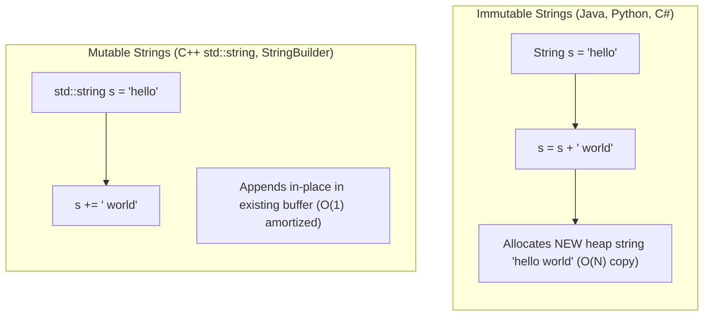

# Strings, Character Encodings & Pattern Manipulation

## TL;DR

A **String** is a sequence of characters representing textual data. Under the hood, characters are stored as numerical byte sequences using character encodings (e.g., ASCII, UTF-8, UTF-16). String performance depends heavily on whether strings in the host programming language are **mutable** (C++) or **immutable** (Python, Java, Go).

---

## 1. Character Encodings & Memory Representation

```text
Character 'A'  ──► ASCII / UTF-8 Byte Value: 65  (Binary: 01000001)
Character 'a'  ──► ASCII / UTF-8 Byte Value: 97  (Binary: 01100001)
Difference: 'a' - 'A' = 32  (Bit 5 toggled)
```

### ASCII vs UTF-8 Encodings

| Encoding Standard | Bytes per Character | Character Coverage | Standard Mapping Range |
|---|---|---|---|
| **ASCII** | 1 Byte (7/8 bits) | 128 characters | Basic English alphabet, digits, basic symbols ($0 - 127$) |
| **Extended ASCII** | 1 Byte | 256 characters | Includes special symbols ($0 - 255$) |
| **UTF-8** | Variable (1 to 4 Bytes) | $1,114,112$ Unicode code points | Backward-compatible with ASCII (1st byte identical) |

---

## 2. Mutability vs Immutability: Performance Impact



### Concatenation Benchmark Trap

Concatenating $N$ single characters into an immutable string in a loop:

```python
# 🚨 DANGEROUS: O(N²) Time Complexity due to repeated string copying!
s = ""
for char in char_list:
    s += char  # Creates a new string of size 1, 2, 3, ..., N on each iteration!

# ✅ OPTIMAL: O(N) Time Complexity using array join / StringBuilder
s = "".join(char_list)
```

---

## 3. The Frequency Array Pattern ($O(1)$ Space Trick)

When dealing with English lowercase letters (`'a'` to `'z'`), avoid using hash maps. Use a fixed-size integer array of size 26.

```text
Map character 'c' to index:  index = ord('c') - ord('a')  (99 - 97 = 2)

Frequency Array (Size 26):
Index:   0   1   2   3  ...  25
       ┌───┬───┬───┬───┬───┬───┐
Count: │ 0 │ 0 │ 1 │ 0 │...│ 0 │  ('c' recorded at index 2)
       └───┴───┴───┴───┴───┴───┘
```

---

## 4. Fundamental String Operations & Complexity

| Operation | C++ `std::string` | Java `String` | Python `str` | Time Complexity | Auxiliary Space |
|---|---|---|---|---|---|
| **Access `S[i]`** | `S[i]` | `S.charAt(i)` | `S[i]` | $O(1)$ | $O(1)$ |
| **Length `N`** | `S.length()` | `S.length()` | `len(S)` | $O(1)$ | $O(1)$ |
| **Concatenation `S1 + S2`** | `S1 += S2` | `S1 + S2` | `S1 + S2` | $O(|S_1| + |S_2|)$ | $O(|S_1| + |S_2|)$ |
| **Substring `S[i:j]`** | `S.substr(i, len)` | `S.substring(i, j)` | `S[i:j]` | $O(k)$ where $k = j - i$ | $O(k)$ |
| **String Comparison `S1 == S2`** | `S1 == S2` | `S1.equals(S2)` | `S1 == S2` | $O(\min(|S_1|, |S_2|))$ | $O(1)$ |

---

## 5. Core String Algorithms & Patterns

### Pattern A: Valid Anagram Check

Two strings `s` and `t` are **Anagrams** if they contain the exact same characters with the same frequencies.

#### Frequency Array Solution ($O(N)$ Time, $O(1)$ Space)

```python
def is_anagram(s: str, t: str) -> bool:
    """
    Determines if t is an anagram of s.
    Time Complexity: O(N) where N = len(s)
    Auxiliary Space: O(1) (fixed array of size 26)
    """
    if len(s) != len(t):
        return False
        
    counts = [0] * 26
    
    for i in range(len(s)):
        counts[ord(s[i]) - ord('a')] += 1
        counts[ord(t[i]) - ord('a')] -= 1
        
    for count in counts:
        if count != 0:
            return False
            
    return True
```

---

### Pattern B: Longest Palindromic Substring (Expand Around Center)

A **Palindrome** reads the same forward and backward. To find the longest palindromic substring:

#### Center Expansion Intuition

Every palindrome has a center:
- **Odd-length Palindromes**: Center is a single character (e.g., `"racecar"`, center `'e'`).
- **Even-length Palindromes**: Center is between two identical characters (e.g., `"noon"`, center between `'o'` and `'o'`).

For $N$ characters, there are $2N - 1$ potential centers.

```text
Odd Center Snapshot:
      Left     Right
        ◄── 'e' ──►
    [ r , a , c , e , c , a , r ]
          ▲       ▲
          L       R
```

#### Python Implementation

```python
def longest_palindrome(s: str) -> str:
    """
    Finds the longest palindromic substring using Expand Around Center.
    Time Complexity: O(N²)
    Auxiliary Space: O(1)
    """
    if not s:
        return ""
        
    start, max_len = 0, 0
    
    def expand(left: int, right: int) -> int:
        while left >= 0 and right < len(s) and s[left] == s[right]:
            left -= 1
            right += 1
        # Returns length of palindrome expanded
        return right - left - 1

    for i in range(len(s)):
        len1 = expand(i, i)       # Odd length palindrome
        len2 = expand(i, i + 1)   # Even length palindrome
        current_len = max(len1, len2)
        
        if current_len > max_len:
            max_len = current_len
            # Calculate starting index from center i
            start = i - (current_len - 1) // 2
            
    return s[start : start + max_len]
```

---

## 6. Common Pitfalls & Edge Cases

1. **Case Sensitivity**: `'A'` $\neq$ `'a'`. Always clarify whether comparisons should be case-sensitive or if inputs require `.lower()`.
2. **Non-ASCII Characters**: Unicode symbols (like emojis 😃 or accents `é`) take multiple bytes in UTF-8. Using `len(s)` in C++ may count byte length, not character length.
3. **Empty String & Single Character**: Handled as base cases for palindromes and substrings.

---

## 7. Practice Problems

### Foundation
- [LeetCode 125: Valid Palindrome](https://leetcode.com/problems/valid-palindrome/)
- [LeetCode 242: Valid Anagram](https://leetcode.com/problems/valid-anagram/)

### Intermediate
- [LeetCode 5: Longest Palindromic Substring](https://leetcode.com/problems/longest-palindromic-substring/)
- [LeetCode 49: Group Anagrams](https://leetcode.com/problems/group-anagrams/)

### Advanced
- [LeetCode 214: Shortest Palindrome](https://leetcode.com/problems/shortest-palindrome/) (Connects to KMP / Prefix Function)
- [LeetCode 5: Manacher's Algorithm ($O(N)$ Palindrome Search)](https://leetcode.com/problems/longest-palindromic-substring/)

---

## Related Concepts
- [[00 - DSA MOC|Master DSA MOC]]
- [[Arrays]]
- [[Two Pointers]]
- [[Sliding Window]]
- [[Hashing]]
- [[Trie]]
- [[KMP Algorithm]]
