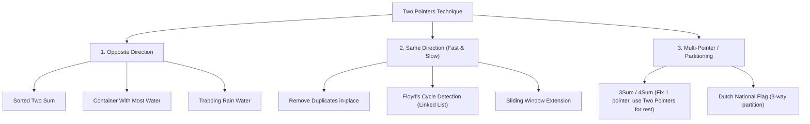

# Two Pointers Technique & Search Space Elimination

## TL;DR

The **Two Pointers** technique uses two integer indices (or node pointers) to traverse a linear data structure simultaneously. By exploiting structural invariants—such as a **sorted array** or a **linked list traversal**—two pointers eliminate entire subsets of the search space at each step, reducing time complexity from $O(N^2)$ to $O(N)$ with $O(1)$ space.

---

## 1. Core Intuition: Why Does Two Pointers Work?

In a naive brute-force approach across an array of size $N$, we test all pairs $(i, j)$ in $O(N^2)$ time.

```text
Naive Search Space Matrix (N x N Pairs):
      j=0  j=1  j=2  j=3  j=4
i=0    X    .    .    .    .
i=1    X    X    .    .    .
i=2    X    X    X    .    .   <-- Evaluates N(N-1)/2 pairs one by one
i=3    X    X    X    X    .
i=4    X    X    X    X    X
```

### Search Space Elimination Axiom

When the array is **sorted**, evaluating pair `(L, R)` gives information about multiple unvisited pairs at once:

```text
Sum = A[L] + A[R]

If Sum > Target:
   Because A[L] is the SMALLEST remaining element, A[L] + A[R] > Target means
   A[i] + A[R] > Target for ALL i > L.
   Conclusion: Element A[R] CANNOT pair with ANY remaining element!
   Action: Safely eliminate R by moving R left (R--). (Eliminates an entire column!)
```

```text
Elimination Visual:
 L                        R
 ↓                        ↓
[1,   3,   5,   8,   11, 15]   Target = 12

Sum = 1 + 15 = 16 > 12
Because 1 is the smallest remaining number, 15 + (anything >= 1) is guaranteed to be > 12.
We eliminate 15 entirely! Move R left.
```

---

## 2. Taxonomy of Two Pointer Variations



---

## 3. Detailed Walkthrough of Key Variations

### Variation 1: Opposite Direction (Two Sum II - Input Array Is Sorted)

#### Problem
Given a 1-indexed sorted array `numbers`, find two numbers such that they add up to `target`.

#### ASCII Pointer Trace

```text
Input: numbers = [2, 7, 11, 15], target = 9

Step 1:
 L              R
 ↓              ↓
[2,   7,   11, 15]    Sum = 2 + 15 = 17. 17 > 9 -> Move R left.

Step 2:
 L        R
 ↓        ↓
[2,   7,   11, 15]    Sum = 2 + 11 = 13. 13 > 9 -> Move R left.

Step 3:
 L   R
 ↓   ↓
[2,  7,   11, 15]    Sum = 2 + 7 = 9. 9 == 9 -> Target found! Return [1, 2].
```

#### Python Implementation

```python
def two_sum_sorted(numbers: list[int], target: int) -> list[int]:
    """
    Two Pointers on Sorted Array.
    Time Complexity: O(N)
    Auxiliary Space: O(1)
    """
    left, right = 0, len(numbers) - 1
    
    while left < right:
        current_sum = numbers[left] + numbers[right]
        if current_sum == target:
            return [left + 1, right + 1] # 1-based indexing
        elif current_sum < target:
            left += 1
        else:
            right -= 1
            
    return []
```

---

### Variation 2: Opposite Direction (Container With Most Water)

Given `height` array of $N$ vertical lines, find two lines that together with the x-axis form a container holding the most water.

$$\text{Area} = \min(\text{height}[L], \text{height}[R]) \times (R - L)$$

#### Key Optimization Insight

To maximize area, we start with the widest width ($L=0, R=N-1$).
Moving either pointer inwards **decreases width by 1**.
To compensate for smaller width, height MUST increase.
Therefore, we MUST move whichever pointer points to the **shorter line**! Moving the taller line can never increase the bottleneck height.

```text
L                                           R
↓                                           ↓
█                                           █
█   █                                   █   █
█   █   █                           █   █   █
4   2   1   ...               ...   3   5   6
Height[L] = 4, Height[R] = 6. Bottleneck = min(4, 6) = 4.
Moving R left cannot increase height above 4, but decreases width!
Therefore, we MUST move L right!
```

#### Python Implementation

```python
def max_area(height: list[int]) -> int:
    """
    Container With Most Water.
    Time Complexity: O(N)
    Auxiliary Space: O(1)
    """
    left, right = 0, len(height) - 1
    max_water = 0
    
    while left < right:
        width = right - left
        h = min(height[left], height[right])
        max_water = max(max_water, width * h)
        
        if height[left] < height[right]:
            left += 1
        else:
            right -= 1
            
    return max_water
```

---

### Variation 3: 3Sum ($O(N^2)$ Triplet Search)

Find all unique triplets `[nums[i], nums[j], nums[k]]` such that $i \neq j \neq k$ and $\text{nums}[i] + \text{nums}[j] + \text{nums}[k] = 0$.

#### Algorithm Strategy
1. **Sort** the array in $O(N \log N)$ time.
2. Iterate index `i` from `0` to `N-3`.
3. For each fixed `nums[i]`, convert the problem into `Two Sum II` for target `-nums[i]` on subarray `nums[i+1 ... N-1]`.
4. Skip duplicate elements for both `i`, `left`, and `right` to avoid duplicate triplets in the output.

#### Python Implementation

```python
def three_sum(nums: list[int]) -> list[list[int]]:
    """
    3Sum using Sorting + Two Pointers.
    Time Complexity: O(N²)
    Auxiliary Space: O(1) (excluding output list)
    """
    nums.sort()
    result = []
    n = len(nums)
    
    for i in range(n - 2):
        # Skip duplicates for first element
        if i > 0 and nums[i] == nums[i - 1]:
            continue
            
        # Optimization: Early break if smallest remaining sum > 0
        if nums[i] + nums[i + 1] + nums[i + 2] > 0:
            break
            
        left, right = i + 1, n - 1
        target = -nums[i]
        
        while left < right:
            current_sum = nums[left] + nums[right]
            if current_sum == target:
                result.append([nums[i], nums[left], nums[right]])
                left += 1
                right -= 1
                # Skip duplicates for second and third elements
                while left < right and nums[left] == nums[left - 1]:
                    left += 1
                while left < right and nums[right] == nums[right + 1]:
                    right -= 1
            elif current_sum < target:
                left += 1
            else:
                right -= 1
                
    return result
```

---

## 4. Common Pitfalls & Edge Cases

1. **Infinite Loops**: Failing to advance `left` or `right` pointers within condition branches leads to infinite loops.
2. **Duplicate Triplets in 3Sum**: Forgetting to skip duplicate adjacent values (`nums[left] == nums[left-1]`) generates duplicate output triplets.
3. **Unsorted Arrays**: Applying opposite-direction search space elimination on an **unsorted** array yields incorrect results. Always sort first if sorting is allowed!

---

## 5. Practice Problems

### Foundation
- [LeetCode 167: Two Sum II - Input Array Is Sorted](https://leetcode.com/problems/two-sum-ii-input-array-is-sorted/)
- [LeetCode 344: Reverse String](https://leetcode.com/problems/reverse-string/)

### Intermediate
- [LeetCode 11: Container With Most Water](https://leetcode.com/problems/container-with-most-water/)
- [LeetCode 15: 3Sum](https://leetcode.com/problems/3sum/)
- [LeetCode 141: Linked List Cycle](https://leetcode.com/problems/linked-list-cycle/) (Floyd's Fast & Slow)

### Advanced
- [LeetCode 42: Trapping Rain Water](https://leetcode.com/problems/trapping-rain-water/)
- [LeetCode 16: 3Sum Closest](https://leetcode.com/problems/3sum-closest/)

---

## Related Concepts
- [[00 - DSA MOC|Master DSA MOC]]
- [[Arrays]]
- [[Strings]]
- [[Sliding Window]]
- [[Binary Search]]
