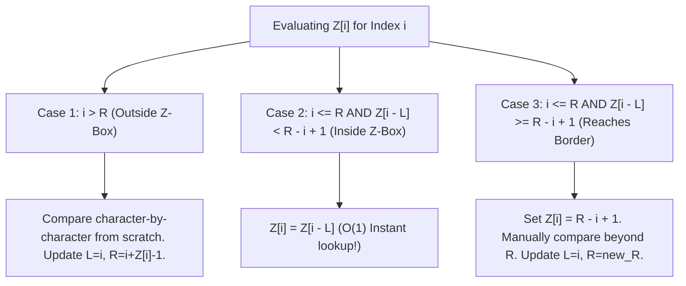

# Z-Algorithm, Z-Boxes & Linear String Matching

## TL;DR

The **Z-Algorithm** computes the **Z-Array** of a string $S$ of length $N$ in **$O(N)$ linear time**.

For any index $i$, **`Z[i]`** represents the length of the **longest substring starting at $S[i]$ that is also a prefix of $S$**. By concatenating pattern and text ($S = P + \$ + T$), the Z-Algorithm solves string matching in $O(|P| + |T|)$ time without explicit state machines.

---

## 1. The Z-Array Definition & Example

For string $S = \text{"a b a c a b a"}$:

| Index `i` | Substring Starting at `S[i]` | Matching Prefix of $S$ | `Z[i]` Value |
|---|---|---|---|
| **0** | `"abacaba"` | N/A (By convention `Z[0] = 0` or $N$) | **0** |
| **1** | `"bacaba"` | `""` | **0** |
| **2** | `"acaba"` | `"a"` | **1** |
| **3** | `"caba"` | `""` | **0** |
| **4** | `"aba"` | `"aba"` | **3** |
| **5** | `"ba"` | `""` | **0** |
| **6** | `"a"` | `"a"` | **1** |

$$\text{Z-Array}: [0, 0, 1, 0, 3, 0, 1]$$

---

## 2. The Z-Box Segment `[L, R]`

To compute `Z[i]` in linear time, the algorithm maintains a **Z-Box `[L, R]`**, which represents the rightmost substring matching a prefix of $S$ discovered so far ($S[L \dots R] == S[0 \dots R-L]$).

```text
Z-Box Coverage Representation:

S:  [0 ───────────────── R-L] ... [L ───────────────── R]
    └────── Prefix ────────┘     └───── Z-Box ───────┘

Since S[L..R] == S[0..R-L], for any i inside [L, R]:
Position i corresponds to k = i - L in the prefix!
```

---

## 3. The 3 Algorithmic Cases



---

## 4. Complete Python Implementation

```python
def build_z_array(s: str) -> list[int]:
    """
    Computes the Z-Array of string s in O(N) linear time.
    Auxiliary Space: O(N)
    """
    n = len(s)
    z = [0] * n
    l, r = 0, 0
    
    for i in range(1, n):
        if i <= r:
            # Inside current Z-box: copy corresponding prefix value
            k = i - l
            z[i] = min(r - i + 1, z[k])
            
        # Try extending match beyond R
        while i + z[i] < n and s[z[i]] == s[i + z[i]]:
            z[i] += 1
            
        # If match extends past R, update Z-box boundaries
        if i + z[i] - 1 > r:
            l = i
            r = i + z[i] - 1
            
    return z

def z_search(text: str, pattern: str) -> list[int]:
    """
    Pattern matching using Z-Algorithm via P + '$' + T concatenation.
    Time Complexity: O(|T| + |P|)
    Auxiliary Space: O(|T| + |P|)
    """
    if not pattern or not text:
        return []
        
    concat = pattern + "$" + text
    z = build_z_array(concat)
    pattern_len = len(pattern)
    matches = []
    
    for i in range(pattern_len + 1, len(concat)):
        if z[i] == pattern_len:
            # Convert concatenated index back to 0-based text index
            text_index = i - pattern_len - 1
            matches.append(text_index)
            
    return matches
```

---

## 5. Z-Algorithm vs KMP Comparison

| Feature | KMP Algorithm | Z-Algorithm |
|---|---|---|
| **Primary Data Structure** | `lps` (Longest Prefix Suffix) array | `Z` (Longest Prefix Match) array |
| **String Concatenation Needed?** | No (Separate matcher loop) | Yes (`P + '$' + T`) |
| **Conceptual Simplicity** | Harder (Fallback pointer logic) | Easier (Explicit Z-Box segment `[L, R]`) |
| **Time & Space Complexity** | **$O(N + M)$** | **$O(N + M)$** |

---

## 6. Common Pitfalls & Edge Cases

1. **Delimiter Collision Bug**: Using a delimiter character (like `$`) that appears naturally inside `text` or `pattern` breaks Z-Box boundaries. Always pick a unique non-alphabet character (e.g. `$` or `#`).
2. **Index Offset Error**: Forgetting that `Z[0] = 0` by convention when iterating from `i = 1` to `N - 1`.
3. **Z-Box Boundary Overflow**: `i + z[i] - 1` must be strictly checked against array length $N$.

---

## 7. Practice Problems

### Foundation
- [LeetCode 28: Find the Index of the First Occurrence in a String](https://leetcode.com/problems/find-the-index-of-the-first-occurrence-in-a-string/)
- [LeetCode 2223: Sum of Scores of Built Strings](https://leetcode.com/problems/sum-of-scores-of-built-strings/) (Direct Z-Sum)

### Intermediate
- [LeetCode 3031: Minimum Time to Revert String to Initial State II](https://leetcode.com/problems/minimum-time-to-revert-string-to-initial-state-ii/)
- [LeetCode 3008: Find Beautiful Indices in the Given Array II](https://leetcode.com/problems/find-beautiful-indices-in-the-given-array-ii/)

### Advanced
- [Codeforces 126B: Password](https://codeforces.com/problemset/problem/126/B) (Z-Array + Prefix Match)

---

## Related Concepts
- [[00 - DSA MOC|Master DSA MOC]]
- [[Strings]]
- [[KMP Algorithm]]
- [[Rolling Hash]]
- [[Trie]]
